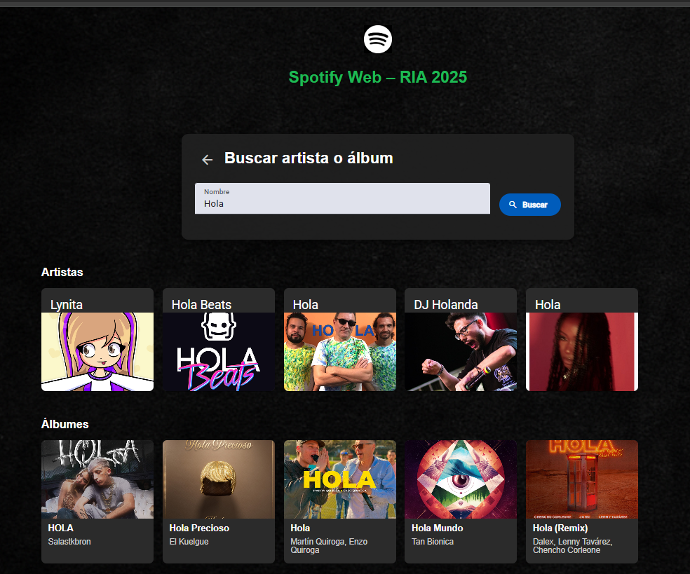

# Spotify Web – RIA 2025

## Índice

- [Servicios REST Públicos Utilizados](#servicios-rest-públicos-utilizados)  
- [Mockups y Mapa de Navegación](#mockups-y-mapa-de-navegación)  
- [Tecnologías y Arquitectura](#tecnologías-y-arquitectura)
- [Rutas y Navegación](#rutas-y-navegación)
- [Componentes Visuales](#componentes-visuales)
- [Calidad y estilo de código](#calidad-y-estilo-de-código)
- [Implementacion de async await](#Implementacion-de-async-await)
- [Historias de Usuario](#historias-de-usuario)  
- [Instalación y Configuración](#instalación-y-configuración)


## Servicios REST Públicos Utilizados

- **Spotify Web API**  
  - **Autenticación** (Client Credentials):  
    `POST https://accounts.spotify.com/api/token`  
  - **Búsqueda de artistas**:  
    `GET https://api.spotify.com/v1/search?q={query}&type=artist`  
  - **Detalle de artista**:  
    `GET https://api.spotify.com/v1/artists/{id}`  
  - **Top Tracks**:  
    `GET https://api.spotify.com/v1/artists/{id}/top-tracks?country=US`  
  - **Nuevos lanzamientos**:  
    `GET https://api.spotify.com/v1/browse/new-releases`  
  - **Detalle de álbum**:  
    `GET https://api.spotify.com/v1/albums/{id}`  


## Mockups y Mapa de Navegación


  
  
  
  
  


## Tecnologías y Arquitectura 

```bash
Framework: Angular
CSS: Angular Material
Comunicación HTTP: HttpClient
Autenticación: Client Credentials
```

## Calidad y estilo de código

Para asegurar un código consistente y libre de errores, hemos añadido las siguientes dependencias de desarrollo:

```bash
npm install --save-dev \
  eslint \
  @angular-eslint/schematics \
  prettier \
  eslint-config-prettier \
  eslint-plugin-prettier
```
ESLint (eslint): analiza tu TypeScript y alerta sobre errores, malas prácticas y código no tipado.
Angular ESLint (@angular-eslint/schematics): reglas específicas para proyectos Angular.
Prettier (prettier): formatea automáticamente tu código .ts, .html y .css/.scss.
eslint-config-prettier: desactiva reglas de ESLint que entren en conflicto con Prettier.
eslint-plugin-prettier: ejecuta Prettier como parte del proceso de lint.

Ejecucion:
```bash
npm run lint   # ejecuta ESLint y autocorrige problemas de TS
npm run format # formatea todo el código con Prettier
```

## Implementacion de async await

Para no encadenar múltiples suscripciones, en el servicio creamos:
```ts
getNewReleasesAsync(token: string, limit = 20): Promise<NewReleasesResponse> {
  return lastValueFrom(this.getNewReleases(token, limit));
}
```
Dentro de un bloque async/await. Así el flujo se lee línea a línea, y con un solo try/catch/finally controlamos todo sin anidar subscribe.

Y en el componente, dentro de ngOnInit():
```ts
// ASYNC AWAIT HERE
(async () => {
  try {
    const res = await this.spotify.getNewReleasesAsync(tok.access_token, 20);
    this.releases = res.albums.items.map((a: Album) => ({
      ...a,
      artistNames: a.artists.map((ar) => ar.name).join(', '),
    }));
  } catch {
    this.error = 'Error al cargar nuevos lanzamientos';
  } finally {
    this.loading = false;
  }
})(); 
```

## Componentes Visuales

- **Tarjetas** (`MatCardModule`)  
  Para mostrar artistas y álbumes en un grid.  
- **Formularios de entrada** (`MatFormFieldModule` + `MatInputModule`)  
  Para el input de búsqueda.  
- **Botones** (`MatButtonModule`)  
  Para “Buscar”, “Empezar a buscar” y volver atrás.  
- **Listas** (`MatListModule`)  
  Para los top-tracks y las pistas de cada álbum.  


## Rutas y Navegación

| Ruta            | Componente         |
| --------------- | ------------------ |
| `/`             | Home               |
| `/search`       | Search             |
| `/search-artist`| SearchArtist       |
| `/artist/:id`   | ArtistDetail       |
| `/albums`       | Albums             |
| `/album/:id`    | AlbumDetail        |
| `**`            | redirige a `/`     |


## Historias de Usuario

### HU01 – Buscar artista o album
**Como** usuario de la página
**Quiero** pulsar el botón “Empezar a buscar”  
**Para** navegar a una vista donde pueda buscar artistas y álbumes de forma conjunta  

**Criterios de aceptación**  
- El botón “Empezar a buscar” en el home redirige a la ruta `/search`.  
- En `/search` aparece el título “Buscar artista o álbum” y un input vacío.
- Si escribo un término y confirmo, se muestran hasta 5 artistas y 5 álbumes en dos secciones (Artistas / Álbumes).

### HU02 – Ver artistas y detalles  
**Como** usuario que busca artistas
**Quiero** ir a la sección de búsqueda de artistas, escribir el nombre de un artista, ver hasta 5 sugerencias y poder seleccionar en una de ellas  
**Para** obtener el detalle completo: nombre, seguidores, foto y sus top-tracks  

**Criterios de aceptación**  
- En la ruta `/search-artist` hay un input de texto con placeholder “e.g. Shakira” y botón de búsqueda.  
- Al escribir un nombre válido y pulsar buscar, aparecen hasta 5 tarjetas de artista con nombre e imagen.  
- Al pinchar una tarjeta voy a `/artist/:id`, donde veo:  
  - Nombre y foto.  
  - Número de seguidores.  
  - Popularidad.  
  - Lista de top-tracks (nombre + duración).

### HU03 – Álbumes destacados  
**Como** usuario que busca álbumes
**Quiero** ver una sección de “Álbumes destacados” con los últimos lanzamientos de Spotify  
**Para** descubrir nuevas publicaciones y navegar fácilmente a su detalle  

**Criterios de aceptación**  
- En el home, bajo “Álbumes destacados”, se muestran hasta 20 portadas de álbumes.  
- Cada tarjeta de álbum muestra imagen y título.  
- Al hacer clic en una tarjeta, navego a `/album/:id`.  
- En `/album/:id` aparece:  
  - Nombre del álbum y lista de artistas.  
  - Fecha de lanzamiento.  
  - Carátula grande.  
  - Listado de todas las pistas con número y duración.  


## Instalación y Configuración

# Clonar repositorio
git clone https://github.com/BraianR/spotify-web-api.git
cd spotify-web-api

# Instalar dependencias
npm install

# Añadir credenciales (src/app/services/api-secrets/spotify-api-keys.ts):
```ts
export const spotifyApiKeys = {
   CLIENT_ID: 'TU_CLIENT_ID',
   CLIENT_SECRET: 'TU_CLIENT_SECRET'
};
```

# Levantar servidor de desarrollo
npm start

# SpotifyWebApi

This project was generated using [Angular CLI](https://github.com/angular/angular-cli) version 20.0.2.

## Development server

To start a local development server, run:

```bash
ng serve
```

Once the server is running, open your browser and navigate to `http://localhost:4200/`. The application will automatically reload whenever you modify any of the source files.

## Code scaffolding

Angular CLI includes powerful code scaffolding tools. To generate a new component, run:

```bash
ng generate component component-name
```

For a complete list of available schematics (such as `components`, `directives`, or `pipes`), run:

```bash
ng generate --help
```

## Building

To build the project run:

```bash
ng build
```

This will compile your project and store the build artifacts in the `dist/` directory. By default, the production build optimizes your application for performance and speed.

## Running unit tests

To execute unit tests with the [Karma](https://karma-runner.github.io) test runner, use the following command:

```bash
ng test
```

## Running end-to-end tests

For end-to-end (e2e) testing, run:

```bash
ng e2e
```

Angular CLI does not come with an end-to-end testing framework by default. You can choose one that suits your needs.

## Additional Resources

For more information on using the Angular CLI, including detailed command references, visit the [Angular CLI Overview and Command Reference](https://angular.dev/tools/cli) page.
