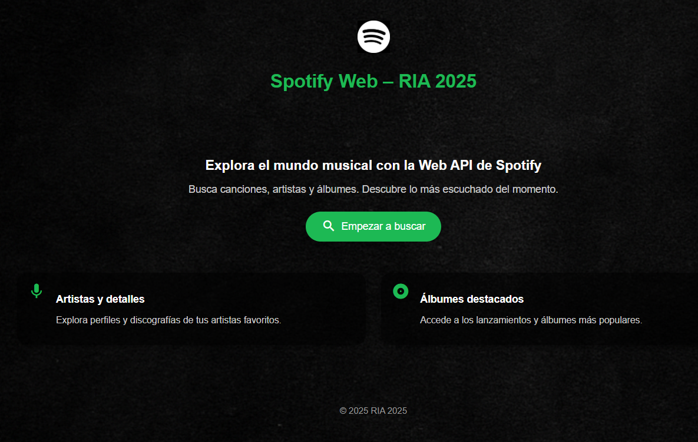
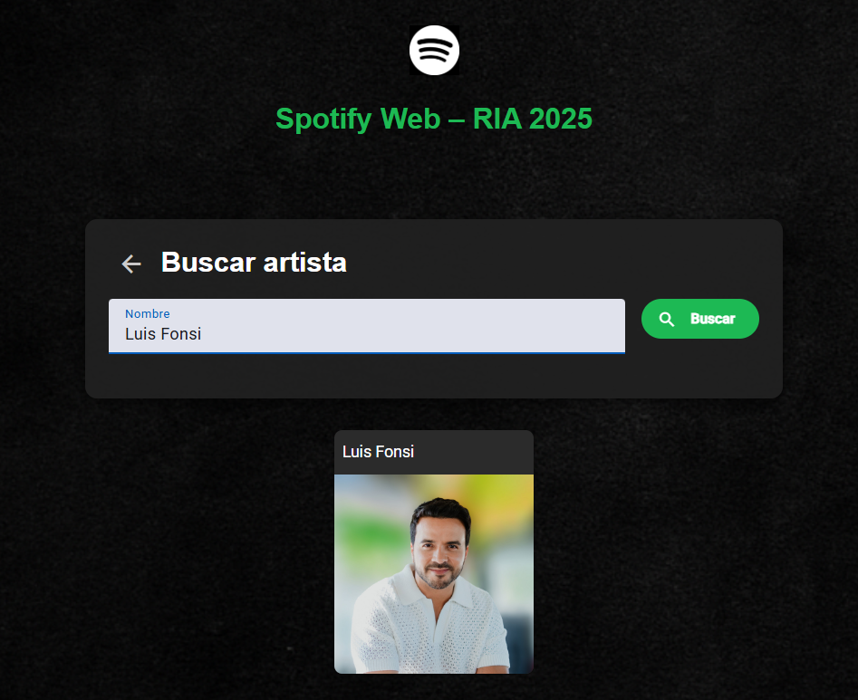
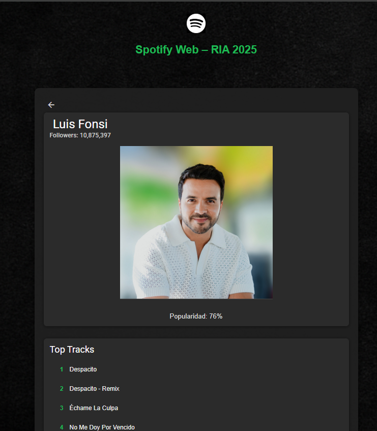
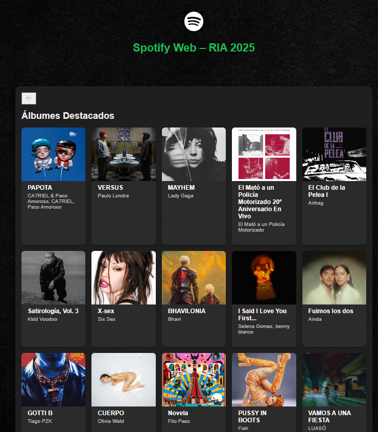
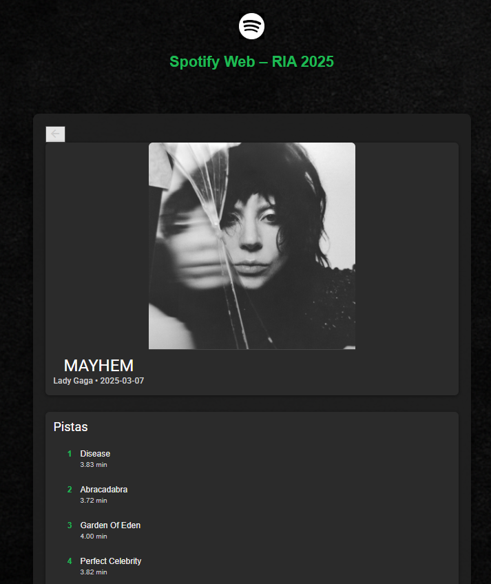

# Spotify Web – RIA 2025

## Índice

- [Historias de Usuario](#historias-de-usuario)  
- [Servicios REST Públicos Utilizados](#servicios-rest-públicos-utilizados)  
- [Mockups y Mapa de Navegación](#mockups-y-mapa-de-navegación)  
- [Tecnologías y Arquitectura](#tecnologías-y-arquitectura)  
- [Componentes Visuales](#componentes-visuales)  
- [Rutas y Navegación](#rutas-y-navegación)  
- [Instalación y Configuración](#instalación-y-configuración)  

---

## Historias de Usuario

1. **Buscar artistas** por nombre y ver sus perfiles.  
2. **Ver detalle de artista**: imagen, seguidores, popularidad y top-tracks.  
3. **Explorar nuevos lanzamientos** de Spotify.  
4. **Ver detalle de álbum**: carátula, artistas, fecha y lista de canciones.  
5. **Navegar** fluidamente entre home, búsqueda, artista y álbum.

---

## Servicios REST Públicos Utilizados

- **Spotify Web API**  
  - **Autenticación** (Client Credentials):  
    `POST https://accounts.spotify.com/api/token`  
  - **Búsqueda de artistas**:  
    `GET https://api.spotify.com/v1/search?q={query}&type=artist`  
  - **Detalle de artista**:  
    `GET https://api.spotify.com/v1/artists/{id}`  
  - **Top Tracks**:  
    `GET https://api.spotify.com/v1/artists/{id}/top-tracks?country=US`  
  - **Nuevos lanzamientos**:  
    `GET https://api.spotify.com/v1/browse/new-releases`  
  - **Detalle de álbum**:  
    `GET https://api.spotify.com/v1/albums/{id}`  
  - **Pistas de álbum**:  
    `GET https://api.spotify.com/v1/albums/{id}/tracks`

---

## Mockups y Mapa de Navegación

  
  
  
  
  


# Tecnologías y Arquitectura 
Framework: Angular
CSS: Angular Material
Comunicación HTTP: HttpClient
Autenticación: Client Credentials

## ########################################################### ##

## Componentes Visuales
Home
SearchArtist
ArtistDetail
Albums
AlbumDetail

## Rutas y Navegación
| Ruta          | Componente            |
| ------------- | --------------------- |
| `/`           | HomeComponent         |
| `/search`     | SearchComponent       |
| `/artist/:id` | ArtistDetailComponent |
| `/albums`     | AlbumsComponent       |
| `/album/:id`  | AlbumDetailComponent  |
| `**`          | redirige a `/`        |


## ########################################################### ##

Instalación y Configuración

# Clonar repositorio
git clone https://github.com/BraianR/spotify-web-api.git
cd spotify-web-api

# Instalar dependencias
npm install

# Añadir credenciales (src/app/services/api-secrets/spotify-api-keys.ts):
# export const spotifyApiKeys = {
#   CLIENT_ID: 'TU_CLIENT_ID',
#   CLIENT_SECRET: 'TU_CLIENT_SECRET'
# };

# Levantar servidor de desarrollo
npm start

## ########################################################### ##

# SpotifyWebApi

This project was generated using [Angular CLI](https://github.com/angular/angular-cli) version 20.0.2.

## Development server

To start a local development server, run:

```bash
ng serve
```

Once the server is running, open your browser and navigate to `http://localhost:4200/`. The application will automatically reload whenever you modify any of the source files.

## Code scaffolding

Angular CLI includes powerful code scaffolding tools. To generate a new component, run:

```bash
ng generate component component-name
```

For a complete list of available schematics (such as `components`, `directives`, or `pipes`), run:

```bash
ng generate --help
```

## Building

To build the project run:

```bash
ng build
```

This will compile your project and store the build artifacts in the `dist/` directory. By default, the production build optimizes your application for performance and speed.

## Running unit tests

To execute unit tests with the [Karma](https://karma-runner.github.io) test runner, use the following command:

```bash
ng test
```

## Running end-to-end tests

For end-to-end (e2e) testing, run:

```bash
ng e2e
```

Angular CLI does not come with an end-to-end testing framework by default. You can choose one that suits your needs.

## Additional Resources

For more information on using the Angular CLI, including detailed command references, visit the [Angular CLI Overview and Command Reference](https://angular.dev/tools/cli) page.
